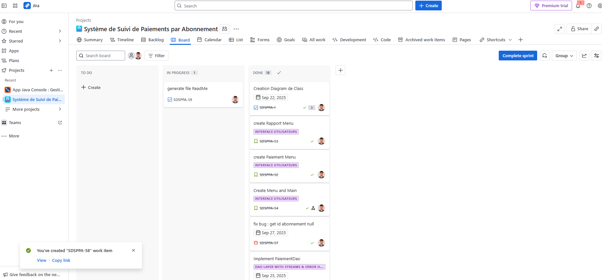
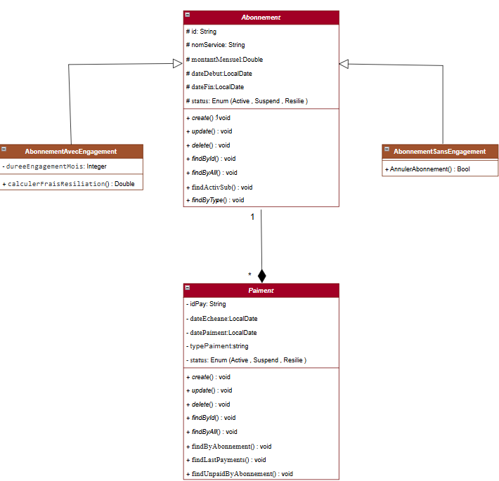
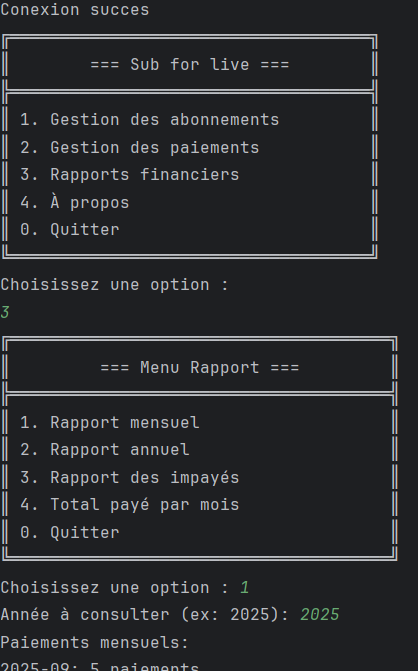

# 📅 SubTrackr – Smart Subscription Manager

### Gérez facilement vos abonnements et paiements grâce à une application console Java 8 moderne, modulaire et robuste.

---

## 🌟 Aperçu du Projet

SubTrackr est une **application Java console** qui simplifie la gestion et le suivi des abonnements et de leurs paiements.  
Elle permet de centraliser l’information, d’automatiser les opérations courantes et de produire des rapports financiers précis pour particuliers ou entreprises.

- **Gestion des abonnements** : création, modification, suppression, consultation.
- **Gestion des paiements** : enregistrement, modification, suppression, suivi des impayés.
- **Rapports financiers** : mensuels, annuels, impayés.
- **Architecture claire** : séparation présentation, métier, utilitaires.
- **Suivi projet** : gestion des tâches via JIRA ou GitHub Issues.

---

## 🛠️ Fonctionnalités

### Fonctionnalités principales :
1. **Ajout et édition d’abonnements** (avec/sans engagement)
2. **Gestion des paiements** (enregistrement, modification, suppression)
3. **Consultation et filtrage des abonnements/paiements**
4. **Rapports financiers** (Streams & Collectors)
    - Mensuels, annuels, impayés
5. **Validation des entrées utilisateur et gestion des exceptions**
6. **Menu interactif en console**
7. **Utilisation de Java Time API pour les dates**
8. **Stockage en mémoire avec ArrayList/HashMap**

### Bonus :
- Filtrage et regroupement avancés avec Stream API
- Utilisation d’Optional & expressions lambda
- Persistance MySQL/JDBC (optionnel)

---

## 📸 Screenshots & Diagrammes

### 📊 Tableau JIRA ou GitHub Issues
*Ajoutez ici une capture d’écran de votre gestion de tâches !*  

### 🗂️ Diagramme UML des Classes
*Ajoutez ici votre diagramme UML !*  

### 🖥️ Aperçu Application (console)
*Ajoutez ici des captures d’écran du menu principal ou des rapports !*  

---

## 🚀 Technologies Utilisées

- **Java 8 (JDK 8)**
- **Java Time API**
- **ArrayList, HashMap**
- **Streams & Collectors**
- **JIRA / GitHub Issues**
- **Git**

## 📬 Contact

Pour toute question, ouvrez une issue sur [GitHub](https://github.com/Mahjoubech/Bank-account-management/issues).

---

## ⚖️ Licence

MIT